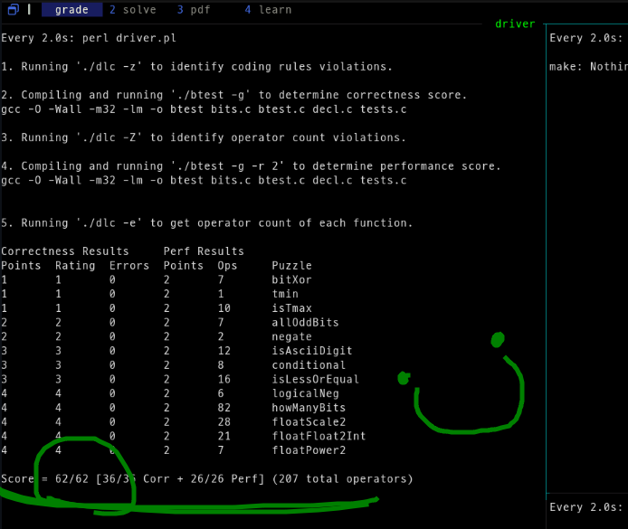
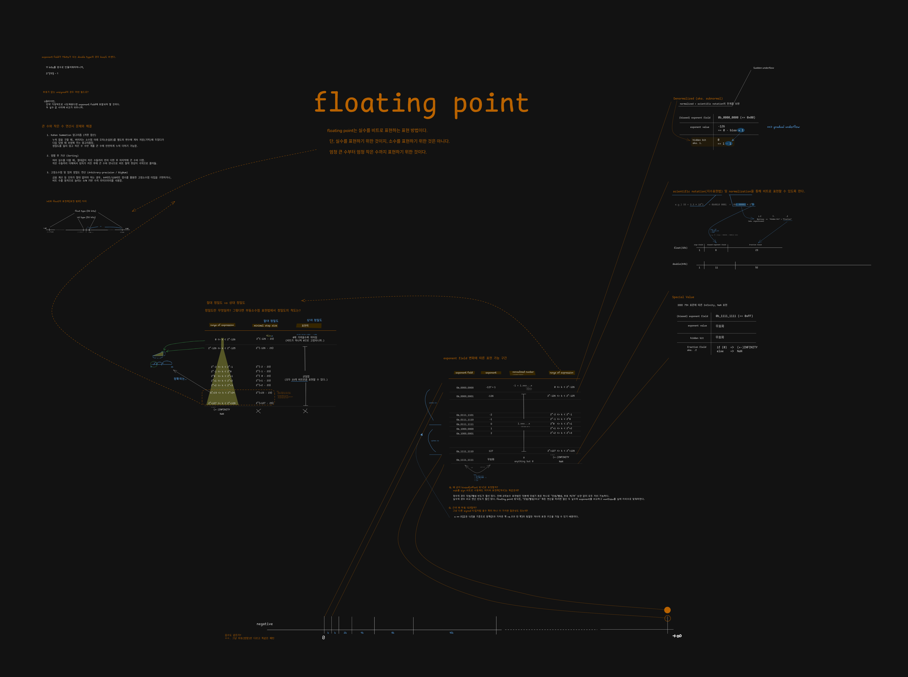

# CS:APP Labs Log

Reference: [Computer Systems: A Programmer's Perspective Lab series](https://csapp.cs.cmu.edu/3e/labs.html)

## Lab 1: Data Lab

### 한 줄 소감

**데이터를 보고 비트 레벨에서 어떻게 담겨있을지 그려낼 수 있게 됐다. 즉, 데이터와 정보는 (bit)해석의 차이라는 것의 내재화.**

<details>
<summary>좀 더 긴 소감</summary>

> 1.  bit 수준에서 데이터를 다루는 연습이었다.
>     -   컴퓨터를 처음 시작할 땐 타입이 저장할 데이터의 속성을 제한하는 것인줄 알았다. 알면
>         알수록 비트의 해석 방법에 가깝다는 생각이 든다.
> 
> 2.  bit level을 다루는데 자신감이 생겼다. 낯설었던 비트 연산자가 (알고 보면)추상화 된 기타
>     연산자보다 오히려 단순하게 느껴졌다.
> 
> 3.  퍼즐을 풀기 위해 부동소수점을 제대로 공부하게 되었다. 크래프톤 정글에서 이걸 처음 마주했을
>     때 참 난감했었는데, 이제는 꽤 할만한 것을 보니 나의 실력이 늘고 있긴 한가보다.
>     -   후배님들께 도움이 되도록 JDC 커뮤니티에 공유도 했다. 강의 영상 촬영은 처음이었는데
>         재미있었다.
> 
> 4.  이렇게 오래되고 유명한 수업 과제에도 오류가 있다는게 인간미 있었다. 기남님과 동료학습
>     과정에서 발견하게 된 것이 매우 반가웠다.
>     -   `islessOrEqual(x, y)` 퍼즐에서 x가 INT_MIN인 경우 보수를 취해도 msb가 바뀌지 않아
>         기존 풀이는 틀렸다.
</details>

<details>
<summary>소요 시간: ~65h</summary>

| Date       |    Time |
| ---------- | ------: |
| 2026-08-24 |      1h |
| 2026-08-25 |      8h |
| 2026-08-26 |      4h |
| 2026-08-28 |      4h |
| 2026-08-29 |      3h |
| 2026-08-30 |      7h |
| 2026-09-02 |      2h |
| 2026-09-03 |     20h |
| 2026-09-04 |      7h |
| 2026-09-06 |      6h |
| **Total**  | **65h** |
</details>

<details>
<summary>최종 점수: 62/62 (correctness 36/36 + perf 26/26)</summary>


</details>
<br/>

### 문제 풀이

-   문제 풀이 설명:
    -   [Youtube: CS:APP - Data Lab 문제 풀이](https://youtu.be/eNjAtC02On4)

-   문제 푸는 과정 실시간 녹화:
    -   [Youtube: datalab - full time part1](https://youtu.be/plu_nphinvI)
    -   [Youtube: datalab - full time part2](https://youtu.be/2Pp8aF9RkFU)
    -   [Youtube: datalab - full time part3](https://youtu.be/1T3IqnbFhEY)
    -   [Youtube: datalab - full time part4](https://youtu.be/VK53wLPoujA)
<br/>

### 학습 내용

-   부동소수점

    -   강의 영상 촬영: [Youtube: 부동소수점이란 무엇인가?](https://youtu.be/yFinGxf0A74)

    <details>
    <summary>시각화</summary>

    
    </details>

-   컴퓨터가 덧셈을 하는 방법

    ```c
    // a + b일 때,
    tmp_a = a;
    a = a ^ b;
    b = (tmp_a & b) << 1;
    // 이것을 b(carry)가 0이 될 때까지 반복한다.
    // 이 방식을 더 빠르게 수행하는 하드웨어도 여럿 있지만, 기본은 이렇다.
    ```
